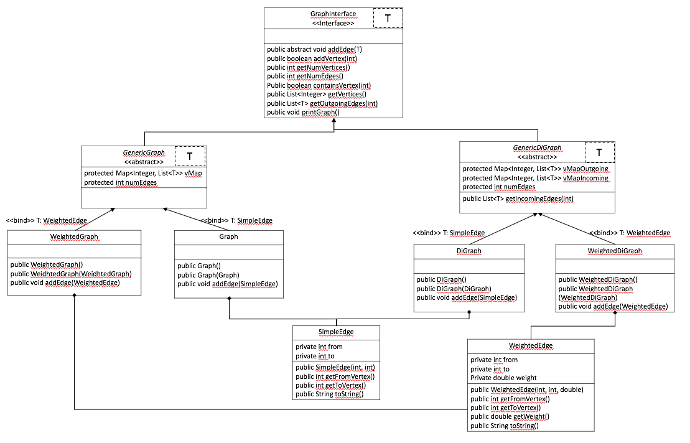

# graphs-galore

## graphs-galore Structure



## Implementation

Implementations of the following graph algorithms are included:

- Breadth First Search

## Input Graphs

Refer to input_directed_unweighted.txt for an input file that represents a graph. First line of an input file must indicate if the graph is directed or undirected. The following lines correspond to edges. For an unweighted graph, each edge is composed of 2 integer vertices. For a weighted graph, each edge is composed of 2 integer vertices and then the weight corresponding to that edge. A visual representation of the graph in input_directed_unweighted.txt is shown here.


## Assumptions

- Vertices are labeled as unique integers.
- Weights are assumed to be of type double.
- Vertices and edges can be added but not removed.

# Breadth First Search

This algorithm takes an a graph, a source vertex, a destination vertex and returns the shortest path from the source to the destination. This will function for either undirected or directed graphs as long as the graph is unweighted.

## Usage

After compiling all files, run BFS as shown. The first argument is the file corresponding to the desired graph. The second argument is an integer source vertex. The third argument is the integer destination vertex.
```
$ BreadthFirstSearch.java input_directed_unweighted.txt 4 5
```

This will result in the following shortest path:
4, 1, 7, 9, 6, 8, 2, 5,

If this graph was indicated as undirected, the following shortest path should be expected:
4, 7, 9, 6, 8, 5, 
